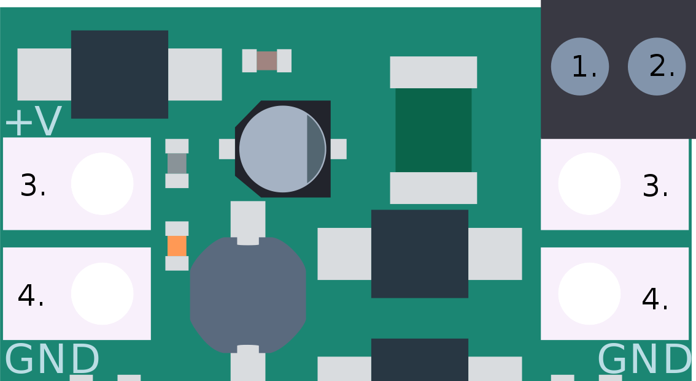
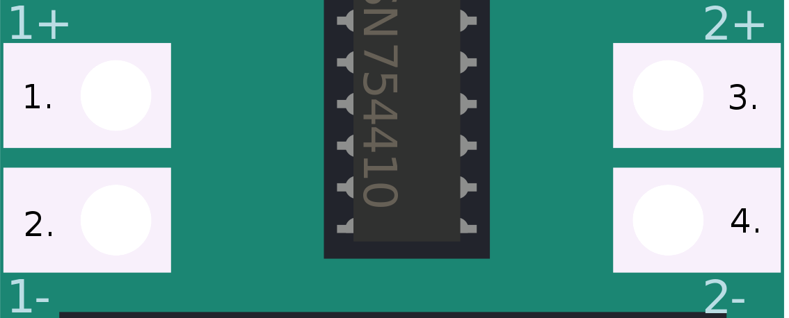

# Robgednaut #

Plataforma de introducción a la robótica, robusta y fácil de usar.

```
                                      'cdkKXWMMMWNXOxl,.
                                .,lkKWMMMMMMMMMMMMMMMMMMXOd:.
                            .;dKMMMMMMMMMMMMMMMMMMMMMMMMMMMMMNkc.
                          :OWMMMMMMMMMMMMMMMMMMMMMMMMMMMMMMMMMMMW0l.
                       .dNMMMMMMMMWKOxoc:;;,,;:cldkKWMMMMMMMMMMMMMMWk,
                     .kWMMMMMW0o;.                   .:o0WMMMMMMMMMMMM0,
                   .xMMMMMXd,                       .    .;kWMMMMMMMMMMMO.
                  :NMMMNd,                         xMW0.     :KMMMMMMMMMMNc
                 dMMMXl.                          .NMNo        ,KMMMMMMMMMMd
                kMMWl                            .KMW;           cNMMMMMMMMMk
               xMWx.                            .KMWc             .OMMMMMMMMMO
              lMW;                   .:c:.......OMMo                xMMMMMMMMMl
             'WN'                  :dc. .OMMMMMMMMW:                 xMMMMMMMMN.
             kW;                  .K      OMMMMMMMMMNc                KMMMMMMMMl
            .Wo                    kl      kMMMMMMMMMMOlkKNMKc        :MMMMMMMM0
            ,K                     X.       cNMMMMMMMMMMKxo0MMNd.      NMMMMMMMW
            ::                    .X         .kWMMMMMMMM'   .oXMMWk    kMMMMMMMM
            ,.            .;ccccld.X.          .oXMMMMMM,      oNK;    dMMMMMMMW
            .       .,cccc:.     O;O;             'oKMMK               xMMMMMMM0
                  'xc'.    .,cld00lo'                .lk.              0MMMMMMMl
                  ,0. .:cokKOdl:'.                     x:             .WMMMMMMN.
                   .d00xlccdo;          .c,..  .'c:..:d:              oMMMMMMMl
                 ;dc:'  .lclkOo,       'OlkOdc:;'..::.               .NMMMMMMO
                ..do.  c0kxxOloko,    .O0o..dl                      .KMMMMMMO
            'o0WMX'.ol..cokxlx0dxkl. .0Ol   k,                     .XMMMMMMk
        .:kNMWOl'    .dl  c:c:ldd0codOko   k:                     'XMMMMMWo
      :OWWOo'          .dl  ,ll:.lo:0kx   d:                     oWMMMMMX,
   'xWMMXl'.             .dc 'lol..Oxk   ol                    ,KMMMMMXc
 '0MMMMMMMMWO.             ,x;    kl0.  od                   ,0MMMMMKc
:WMMMMWWWMMMk               ':d;.k'.oc:ol                 .oXMMMMXd'
 ..... ,KMN;.,lOx      .   'Wo ,o.                    .,dXMMMMKo'
     ;0MMMWNMMMK.  .:kNd   K0:                   ..:d0WMMXOo;.
   :KMMMMMMMMMX. :OWMMM:  xW'            ..,;coxO0Okdl:'.
 cXMMMMMMWMMMM0OWMMMMMMk;0Ml
OMWXOo:'..NMMMMMMMMMMMMMMMx
..       kMMMMMMMMMNWMMMMk
        xMMMMMMMNd,kMMMWo
       dMMMMMWO:  .WMMN;
      ;MMMWOc.     d0c
      lMMk.
```

## Presentación ##

### _Robgednaut_ es creatividad. ###

El nombre está formado por un acrónimo de **Rob**otic (Robótica), Rug**ged** (endurecido) y _-**naut**_ (como astronauta). Es un nombre que define a la perfección lo que es e inspira esta plataforma. Pero no es un nombre muy amigable para ser pronunciado, por eso nosotros lo hemos abreviado cariñosamente en _Roben_, ¡tú puedes hacer lo mismo si quieres!

### _Robgednaut_ es educación libre. ###

Ha sido diseñado para cubrir la carencia de una plataforma educativa robótica que sea libre, asequible y fácil de usar. Desde su sencillez de uso esconde gran potencia y capacidad versátil, así como robustez y fiabilidad. Esto lo hace ideal para procesos de aprendizaje, proyectos, maquetas o productos finales.

### _Robgednaut_ es entretenimiento. ###

Desde la experiencia en entornos educativos, ha sido pensado para cubrir todas las necesidades habituales de éstos dentro del contexto de robótica pedagógica o de áreas STEM. Es sabido que romper cosas es parte normal del proceso de aprendizaje, por ello en la base de concepto de esta plataforma están incluídas múltiples protecciones contra los problemas y errores más habituales.

    *[STEM]: Science, technology, engineering y mathematics*

### _Robgednaut_ es flexibilidad. ###

Te permite hacer realidad tus ideas sin condicionarlas. Es extremadamente moldeable al carecer de electrónica de control y tener conexiones que pueden actuar como entradas o salida multipropósito. Es más, ha sido diseñado para ser usada en conjunción con Arduino, conocida marca que mantiene la filosofía de esta plataforma en cuanto a la orientación educativa y abierta.

### _Robgednaut_ es un universo. ###

Aporta una solución todo en uno, capaz de alimentar dispositivos externos y controlarlos, aparte de los integrados. Por medio de interfaces de comunicación puede ser controlado de forma remota desde un ordenador, dispositivos móviles o funcionar por sí mismo. Además, para integrarse con esta plataforma, están en desarrollo un montón de complementos que expanden las posibilidades mientras se mantienen las bases del proyecto original.

### _Robgednaut_ es lo que desees. ###

Está pensado para que te puedas sentir cómodo. Por ello es ideal para todas las edades. Permite diferentes entornos de programación para adecuarse a cada nivel educativo, y su forma de conexionado permite desde montajes rápidos a través de cocodrilos, o resistentes borneros de clema. Su sistema de alimentación permite funcionar tanto a partir de pilas como de adaptadores de corriente.

### _Robgednaut_ es Taller de Inventores. ###

Desarrollado desde la carencia observada en entornos educativos, se ha probado con éxito de forma piloto dentro del programa de [Taller de Inventores](http://tallerinventores.github.io/), siendo un elemento céntrico en el kit de materiales proporcionado por esta actividad y en los desarrollos realizados.

## Versiones ##

-   La primera versión de _Robgednaut_, conocida simplemente como _Roben_ fue una prueba de concepto y viabilidad. A pesar de que funcionaba con éxito, se observaron múltiples posibilidades de mejora, que deribaron en la siguiente versión.  
-   _Robgednaut Zond_, segunda versión y que debe su nombre al [programa Zond](https://es.wikipedia.org/wiki/Programa_Zond), expande y mejora la version previa en muchos aspectos, manteniendo la misma filosofia. Por desgracia, también introduce cambios que impiden la retrocompatibilidad del diseño. Aunque seguramente esto no te suponga ningún problema.

## Licencia ##

_Robgednaut_ es hardware y software libre liberado bajo [GNU/GPL](https://www.gnu.org/licenses/gpl.html). Más detalles en el archivo [README](https://github.com/akornsys-rdi/robgednaut/blob/master/README.md) del proyecto.

* * *

# _Robgednaut Roben_ #

_Robgednaut_ es la primera generación de esta plataforma. Esta implementación destaca por su sencillez de diseño, enfocado a su uso. Además es más eficiente que sus semejantes, al usar regulación conmutada.

Sus conexiones son los suficientemente amplias como para que puedan ser conectadas con cocodrilos, con un taladro que permite uniones con hilo conductor, y con la separación entre conexiones idónea para montar borneros de doscientas o trescientas milésimas de pulgada. Por supuesto en cualquier caso pueden ser soldadas.

La inclusión de un controlador de motores tipo puente en H, permite poder manejar los tipos de motores más normales, así como solenoides y otras cargas que demanden una corriente moderada. Este controlador se ha elegido pensando en su fácil sustitución en caso de dañarse.

## Diseño y esquemático ##

Los archivos fuente de diseño y los archivos de fabricación están disponibles en [GitHub](https://github.com/akornsys-rdi/robgednaut/tree/release-1/brd). La placa ha sido diseñada con [KiCad EDA](http://kicad-pcb.org/). Se puede acceder aquí directamente al [Esquemático ^PDF^](https://github.com/akornsys-rdi/robgednaut/raw/release-1/brd/bin/roben.pdf).

En el diseño de la placa, se ha tenido en cuenta los costes de fabricación, optimizando el diseño para reducirlos en la medida de lo posible (ancho de pistas vs espesor de cobre, diámetro de taladros y vías, número de capas y tamaño de la PCB).

## Características ##

Las características más relevantes de este diseño:

### Especificaciones ###

| Parámetro | Valor |
|------:|:-----|
| Microcontrolador | Ninguno, zócalo para Arduino Nano v3.x |
| Tensión de funcionamiento (lógica) | 5 V |
| Tensión de entrada (límites) | 6-28 V |
| Conexiones de entrada/salida | 4 |
| Conexiones de motores | 4 |
| Dimensiones | 47,625 x 90,17 mm (1.875 x 3.55 pulgadas) |

Para las especificaciones de Arduino Nano visite la [página oficial](https://www.arduino.cc/en/Main/ArduinoBoardNano).

### Protecciones ###

| Parámetro | Valor | Método |
|------:|:-----|:-----|
| Protección contra sobrecorriente en entrada de alimentación | 2 A | Fusible de restablecimiento (PPTC) |
| Protección contra inversión de polaridad de entrada de alimentación | -40 V | Diodo Schottky |
| Protección contra inyección de tensión en salida 5 V | 45 V | Diodo Schottky |
| Protección contra sobrecorriente en salida 5 V | 2 A | Controlador DC-DC |
| Protección contra sobrecorriente en entrada/salida | 23 mA | Resistencia |
| Protección contra tensión inadecuada en entrada/salida | -10 a 36 V | Diodo Zener |
| Protección contra sobrecorriente en salida de motores | 1 A | Apagado térmico del controlador |

### Alimentación ###

La alimentación se realiza a través de un bornero de alta calidad, con capacidad para conexión a través de cocodrilos. El rango de tensión funcional de esta entrada es de entre seis a veintiocho voltios. Debido a que son valores límite, es recomendable proporcionar una tensión segura dentro de este rango.

La conexión por USB de Arduino Nano tiene la capacidad de alimentar la plataforma, pero puede no proporcionar toda la corriente necesaria para su correcto funcionamiento. Asegúrate de usar siempre la alimentación principal si tienes circuitos montados y vas a conectar el USB.

> Advertencia: Alimentar _Robgednaut_ únicamente a través del puerto USB de Arduino puede provocar comportamientos anómalos y posibles daños al elemento que esté suministrando tensión al USB (normalmente un ordenador).

Las cuatro conexiones superiores de la placa son la salida de alimentación que ésta provee. La salida consiste en 5 V regulados con una capacidad total máxima de 2 A. Esta capacidad de corriente se ve reducida especialmente si se están usando motores al mismo tiempo.



    [^_image1]: 1. Borne positivo de entrada de alimentación. 2. Borne negativo de entrada de alimentación. 3. Conexión de salida positivo 5 V `+V`. 4. Conexión de salida negativo `GND`.

### Microcontrolador ###

_Robgednaut_ carece de microcontrolador, decisión que responde a los siguientes argumentos:

-   Proveer de un zócalo permite el fácil reemplazo o intercambio de microcontroladores a modo de módulos.  
-   Soporta múltiples entornos de desarrollo con el mismo esquema de conexiones.  
-   Aprovecha el ecosistema de Arduino y su comunidad (ver abajo).  
-   Permite la integración de desarrollos propios.  
-   Abarata la propia plataforma.

El zócalo aporta compatibilidad directa con Arduino Nano v3.x, como primera opción para el módulo microcontrolador. Arduino posee un IDE desarollado estable con múltiples IDE alternativos y un gran conjunto de librerías. Como plataforma es maduro y estable, con una gran comunidad a su alrededor, por lo que se crea una relación simbiótica. Además, el microcontrolador es electricamente robusto y usa compilador libre.

> Nota: El zócalo estandarizado compatible es de 32 patillas. Debido a que Arduino Nano posee 30 patillas, se usa como referencia el pin uno para su alineación.

En el zócalo del microcontrolador es posible colocar, con un adaptador, múltiples entornos embebidos. ¡Usa _Robgednaut_ con tu PIC, MSP430, ARM, 8051 o la que sea tu plataforma habitual!


    [^_image2]: Detalle de orientación y alineación de montaje de Arduino Nano sobre _Robgednaut_.

### Entrada/Salida ###

Las cuatro conexiones de entrada/salida de propósito general provistas por _Robgednaut_ agrupan muchas de las funciones específicas de Arduino, concentrando todo su potencial en pocas conexiones. De esta manera, es más sencillo entender y manejar. Si echas en falta conexiones, siempre puedes expandir mediante las conexiones serie digitales o dar el salto usar el módulo microcontrolador por sí solo.

> Advertencia: Asegúrate de tener el firmare adecuado antes de conectar tu Arduino Nano a _Robgednaut_. De no ser así, puedes dañar tu Arduino.

Todas las conexiones de _Robgednaut_ son entradas analógicas y entradas/salidas digitales, pero además poseen algunas capacidades especiales:

-   Interrupciones externas en las conexiones `A` y `B`.  
-   Salidas PWM en las conexiones `B` y `D`.  
-   Bus [SPI](https://es.wikipedia.org/wiki/Serial_Peripheral_Interface) en `C` (SCK) y `D` (MOSI)[^1^].  
-   Bus [I^2^C](https://es.wikipedia.org/wiki/I%C2%B2C) en `C` (SCL) y `D` (SDA).

    [^1^]: MISO no presente. SS puede ser cualquiera de las otras conexiones.

| Robgednaut | Arduino Nano v3.x | Función |
|-----:|:-----|:-----|
| `A` | `D2`, `A2` | Entrada analógica, entrada/salida digital, interrupción externa |
| `B` | `D3`, `A3` | Entrada analógica, entrada/salida digital, salida PWM, interrupción externa |
| `C` | `D13`, `A5` | Entrada analógica, entrada/salida digital, Comunicación serie (SCL y SCK) |
| `D` | `D11`, `A4` | Entrada analógica, entrada/salida digital, salida PWM, Comunicación serie (SDA y MOSI) |


    [^_image3]: 1. Conexión `A`. 2. Conexión `B`. 3. Conexión `C`. 4. Conexión `D`.

### Motores ###

La plataforma integra un controlador de motores tipo puente en H, capaz de mover hasta cuatro motores de continua en un único sentido, dos en ambos sentidos, o un motor paso a paso. Además, el controlador puede ser usado además para mover otro tipo de cargas de corriente media, como pueden ser solenoides, lámparas o ser usadas como salidas digitales convencionales[^2^].

    [^2^]: Las salidas del controlador de motores son tipo _push-pull_, lo que puede ocasionar problemas con aquellos dispositivos que requieran alta impedancia o temporizaciones precisas.

El controlador usado está montado en zócalo para su fácil reemplazo en caso de dañarse. Originalmente se integra el componente SN754410, que es una versión mejorada del L293D, pero compatible con ésta. Cualquiera de los dos controladores puede usarse en _Robgednaut_.

Este controlador integra dos puentes en H, dividido en mitades. Cada puente en H debe ser habilitado para su uso.

| Robgednaut | Arduino Nano v3.x | Función |
|-----:|:-----|:-----|
| 1+ | `D7` (en), `D5` (PWM) | Salida de la mitad positiva del puente en H 1[^3^] |
| 1- | `D7` (en), `D6` (PWM) | Salida de la mitad negativa del puente en H 1[^3^] |
| 2+ | `D8` (en), `D9` (PWM) | Salida de la mitad positiva del puente en H 2[^3^] |
| 2- | `D8` (en), `D10` (PWM) | Salida de la mitad negativa del puente en H 2[^3^] |

    [^3^]: Las polaridades del las mitades de los puente en H se pueden invertir por software. Usando estas conexiones por defecto los motores de continua avanzarán hacia delante.



    [^_image4]: 1. Borne positivo de conexión `1+`. 2. Borne negativo de conexión `1-`. 3. Borne positivo de conexión `2+`. 4. Borne negativo de conexión `2-`.

## Programación ##

La programación depende directamente de qué microcontrolador/entorno se esté usando. Puede programarse desde el IDE del entorno embebido, o usarse programación por bloques con un interfaz adecuado. Esto es: Programar _Robgednaut_ con Arduino en Scratch usando Firmata.

### Firmware ###

Por defecto, _Robgednaut_ provee una librería para el IDE de Arduino, así como un firmware específico para Arduino compatible con Firmata. Ambos pueden encontrarse en el repositorio de firmware de [Github](https://github.com/akornsys-rdi/robgednaut-firmware).

> Advertencia: Si creas tu propio firmware sin usar la librería proporcionada, recuerda al usar las conexiones de entrada/salida poner en alta impedancia la conexión que no estés usando en cada momento, o podrás dañar tu Arduino.

## Caja ##

Para la protección de _Robgednaut_, así como para evitar posibles cortocircuitos durante su uso, se incluye una caja imprimible en 3D para resguardar la plataforma. Esta caja incluye la serigrafía de las conexiones y facilita su montaje.

Puede accederse a los archivos fuente de diseño y los archivos de fabricación en [GitHub](https://github.com/akornsys-rdi/robgednaut/tree/release-1/3d).

* * *

# _Robgednaut Zond_ #

_Robgednaut Zond_ es la segunda generación de esta plataforma. Esta implementación es una revisión exhaustiva de la anterior, que incluye gran cantidad de mejoras y cambios. ¡Practicamente se ha duplicado el número de componentes en placa!

Se mantienen las características conexiones amplias, así como el controlador de motores y el zócalo para el microcontrolador.

> Advertencia: Algunos de los cambios de _Robgednaut Zond_, la hacen incompatible en firmware y conexionado con respecto a la anterior versión. Comprueba las tablas de conexionado para adaptar tu sistema.

## Novedades ##

-   _Robgednaut_ ahora integra los dipositivos más comunes para que no tengas que conectarlos. Se trata de tres indicadores LED de diferentes colores, dos pulsadores y un altavoz piezoeléctrico.  
-   Todo es mejor con LED. Ahora, cada una de las conexiones lleva un LED para indicar su estado, sin que ello afecte a su funcionamiento.  
-   Rango de tensión de entrada ampliado. Ahora es posible hacer funcionar _Robgednaut_ desde tres voltios hasta treinta y dos. Además, la alimentación de entrada puede conectarse a través de un bornero o mediante conector de barril.  
-   Aviso de batería baja, puesto que la plataforma está pensada para ser móvil, se ha añadido un indicador que se activa cuando la tensión de entrada baja de los cuatro voltios.  
-   Interruptor de encendido, para no tener que desconectar la alimentación.  
-   Puedes elegir la tensión a la que se activan los motores (o lo que conectes en estas salidas). Ahora se puede elegir entre la tensión de entrada o cinco voltios.  
-   Comunicación bluetooth, para poder controlar tu _Robgednaut_ desde dispositivos inteligentes.

## Diseño y esquemático ##

Los archivos fuente de diseño y los archivos de fabricación están disponibles en [GitHub](https://github.com/akornsys-rdi/robgednaut/tree/release-2/brd). La placa ha sido diseñada con [KiCad EDA](http://kicad-pcb.org/). Se puede acceder aquí directamente al [Esquemático ^PDF^](https://github.com/akornsys-rdi/robgednaut/raw/release-2/brd/bin/roben.pdf).

En el diseño de la placa, se ha tenido en cuenta los costes de fabricación, optimizando el diseño para reducirlos en la medida de lo posible (ancho de pistas vs espesor de cobre, diámetro de taladros y vías, número de capas y tamaño de la PCB).

Así mismo, se ha cuidado la elección de los componentes usados para que no suponga un gran aumento de costes por todos los cambios en comparación de la versión previa.

## Características ##

Las características más relevantes de este diseño:

### Especificaciones ###

| Parámetro | Valor |
|------:|:-----|
| Microcontrolador | Ninguno, zócalo para Arduino Nano v3.x |
| Tensión de funcionamiento (lógica) | 5 V |
| Tensión de entrada (límites) | 3-32 V |
| Conexiones de entrada/salida | 4 |
| Conexiones de motores | 4 |
| Dimensiones | 47,625 x 90,17 mm (1.875 x 3.55 pulgadas) |

Para las especificaciones de Arduino Nano visite la [página oficial](https://www.arduino.cc/en/Main/ArduinoBoardNano).

### Protecciones ###

| Parámetro | Valor | Método |
|------:|:-----|:-----|
| Protección contra sobrecorriente en entrada de alimentación | 1.5 A | Fusible de restablecimiento (PPTC) |
| Protección contra inversión de polaridad de entrada de alimentación | -40 V | Diodo Schottky |
| Protección contra inyección de tensión en salida 5 V | 45 V | Diodo Schottky |
| Protección contra sobrecorriente en salida 5 V | 2 A | Controlador DC-DC |
| Protección contra sobrecorriente en entrada/salida | 23 mA | Resistencia |
| Protección contra tensión inadecuada en entrada/salida | -10 a 36 V | Diodo Zener |
| Protección contra sobrecorriente en salida de motores | 1 A | Apagado térmico del controlador |

### Alimentación ###

La alimentación se realiza a través de una de las dos opciones posibles: Un bornero de alta calidad, con capacidad para conexión a través de cocodrilos, o un conector tipo barril. El conector hembra de la opción seleccionada se suelda sobre la placa. El rango de tensión funcional de esta entrada es de entre tres a treinta y dos voltios. Debido a que son valores límite, es recomendable proporcionar una tensión segura dentro de este rango.

Ser móvil ha sido uno de los objetivos de esta plataforma desde el principio, por ello se ha rediseñado el regulador para funcionar mejor a través de pilas. Pero las pilas progresivamente se descargan y todo el sistema pierde fuerza. Así que en esta revisión se ha añadido también un indicador de batería baja, que se activa cuando la tensión de entrada baja de los cuatro voltios. Esto lo hace ideal para cuando se alimenta a partir de paquetes de cuatro baterías o tres pilas.

La mayoría de los entornos de desarrollo obligan a desconectar el cable para apagar el sistema, algo que casi se da por hecho. Pero ya está solucionado, se ha añadido un interruptor que apaga el regulador, para que no tengas que desmontar nada.

La conexión por USB de Arduino Nano tiene la capacidad de alimentar la plataforma independientemente del interruptor de apagado, pero puede no proporcionar toda la corriente necesaria para su correcto funcionamiento. Asegúrate de usar siempre la alimentación principal si tienes circuitos montados y vas a conectar el USB.

> Advertencia: Alimentar _Robgednaut_ únicamente a través del puerto USB de Arduino puede provocar comportamientos anómalos y posibles daños al elemento que esté suministrando tensión al USB (normalmente un ordenador).

Las cuatro conexiones superiores de la placa son la salida de alimentación que ésta provee. La salida consiste en 5 V regulados con una capacidad total máxima de 2 A. Esta capacidad de corriente se ve reducida especialmente si se están usando motores al mismo tiempo.


    [^_image5]: 1. Borne positivo de entrada de alimentación. 2. Borne negativo de entrada de alimentación. 3. Conexión de salida positivo 5 V `+V`. 4. Conexión de salida negativo `GND`.

### Microcontrolador ###

_Robgednaut_ carece de microcontrolador, decisión que responde a los siguientes argumentos:

-   Proveer de un zócalo permite el fácil reemplazo o intercambio de microcontroladores a modo de módulos.  
-   Soporta múltiples entornos de desarrollo con el mismo esquema de conexiones.  
-   Aprovecha el ecosistema de Arduino y su comunidad (ver abajo).  
-   Permite la integración de desarrollos propios.  
-   Abarata la propia plataforma.

El zócalo aporta compatibilidad directa con Arduino Nano v3.x, como primera opción para el módulo microcontrolador. Arduino posee un IDE desarollado estable con múltiples IDE alternativos y un gran conjunto de librerías. Como plataforma es maduro y estable, con una gran comunidad a su alrededor, por lo que se crea una relación simbiótica. Además, el microcontrolador es electricamente robusto y usa compilador libre.

> Nota: El zócalo estandarizado compatible es de 32 patillas. Debido a que Arduino Nano posee 30 patillas, se usa como referencia el pin uno para su alineación.

En el zócalo del microcontrolador es posible colocar, con un adaptador, múltiples entornos embebidos. ¡Usa _Robgednaut_ con tu PIC, MSP430, ARM, 8051 o la que sea tu plataforma habitual!


    [^_image6]: Detalle de orientación y alineación de montaje de Arduino Nano sobre _Robgednaut_.

### Entrada/Salida ###

Las cuatro conexiones de entrada/salida de propósito general provistas por _Robgednaut_ agrupan muchas de las funciones específicas de Arduino, concentrando todo su potencial en pocas conexiones. De esta manera, es más sencillo entender y manejar. Si echas en falta conexiones, siempre puedes expandir mediante las conexiones serie digitales o dar el salto usar el módulo microcontrolador por sí solo.

> Advertencia: Asegúrate de tener el firmare adecuado antes de conectar tu Arduino Nano a _Robgednaut_. De no ser así, puedes dañar tu Arduino.

Todas las conexiones de _Robgednaut_ son entradas analógicas y entradas/salidas digitales, pero además poseen algunas capacidades especiales:

-   Interrupciones externas en las conexiones `A` y `B`.  
-   Salidas PWM en las conexiones `B` y `D`.  
-   Bus [SPI](https://es.wikipedia.org/wiki/Serial_Peripheral_Interface) en `C` (SCK) y `D` (MOSI)[^1^].  
-   Bus [I^2^C](https://es.wikipedia.org/wiki/I%C2%B2C) en `C` (SDA) y `D` (SCL).

    [^1^]: MISO no presente. SS puede ser cualquiera de las otras conexiones.

| Robgednaut | Arduino Nano v3.x | Función |
|-----:|:-----|:-----|
| `A` | `D2`, `A7` | Entrada analógica, entrada/salida digital, interrupción externa |
| `B` | `D3`, `A6` | Entrada analógica, entrada/salida digital, salida PWM, interrupción externa |
| `C` | `D13`, `A4` | Entrada analógica, entrada/salida digital, comunicación serie (SDA y SCK) |
| `D` | `D11`, `A5` | Entrada analógica, entrada/salida digital, salida PWM, comunicación serie (SCL y MOSI) |
| Interno | `D4` | Altavoz piezoeléctrico |
| Interno | `D12` | LED rojo |
| Interno | `A0` | LED amarillo |
| Interno | `A1` | LED verde |
| Interno | `A2` | Pulsador |
| Interno | `A3` | Pulsador |


    [^_image7]: 1. Conexión `A`. 2. Conexión `B`. 3. Conexión `C`. 4. Conexión `D`.

### Motores ###

La plataforma integra un controlador de motores tipo puente en H, capaz de mover hasta cuatro motores de continua en un único sentido, dos en ambos sentidos, o un motor paso a paso. Además, el controlador puede ser usado además para mover otro tipo de cargas de corriente media, como pueden ser solenoides, lámparas o ser usadas como salidas digitales convencionales[^2^].

    [^2^]: Las salidas del controlador de motores son tipo _push-pull_, lo que puede ocasionar problemas con aquellos dispositivos que requieran alta impedancia o temporizaciones precisas.

El controlador usado está montado en zócalo para su fácil reemplazo en caso de dañarse. Originalmente se integra el componente SN754410, que es una versión mejorada del L293D, pero compatible con ésta. Cualquiera de los dos controladores puede usarse en _Robgednaut_.

Este controlador integra dos puentes en H, dividido en mitades. Cada puente en H debe ser habilitado para su uso.

| Robgednaut | Arduino Nano v3.x | Función |
|-----:|:-----|:-----|
| 1+ | `D8` (en), `D10` (PWM) | Salida de la mitad positiva del puente en H 1[^3^] |
| 1- | `D7` (en), `D5` (PWM) | Salida de la mitad negativa del puente en H 1[^3^] |
| 2+ | `D8` (en), `D9` (PWM) | Salida de la mitad positiva del puente en H 2[^3^] |
| 2- | `D7` (en), `D6` (PWM) | Salida de la mitad negativa del puente en H 2[^3^] |

    [^3^]: Las polaridades del las mitades de los puente en H se pueden invertir por software. Usando estas conexiones por defecto los motores de continua avanzarán hacia delante.


    [^_image8]: 1. Borne positivo de conexión `1+`. 2. Borne negativo de conexión `1-`. 3. Borne positivo de conexión `2+`. 4. Borne negativo de conexión `2-`.

## Programación ##

La programación depende directamente de qué microcontrolador/entorno se esté usando. Puede programarse desde el IDE del entorno embebido, o usarse programación por bloques con un interfaz adecuado. Esto es: Programar _Robgednaut_ con Arduino en Scratch usando Firmata.

### Firmware ###

Por defecto, _Robgednaut_ provee una librería para el IDE de Arduino, así como un firmware específico para Arduino compatible con Firmata. Ambos pueden encontrarse en el repositorio de firmware de [Github](https://github.com/akornsys-rdi/robgednaut-firmware).

> Advertencia: Si creas tu propio firmware sin usar la librería proporcionada, recuerda al usar las conexiones de entrada/salida poner en alta impedancia la conexión que no estés usando en cada momento, o podrás dañar tu Arduino.

## Caja ##

Para la protección de _Robgednaut_, así como para evitar posibles cortocircuitos durante su uso, se incluye una caja imprimible en 3D para resguardar la plataforma. Esta caja incluye la serigrafía de las conexiones y facilita su montaje, mientras mantiene accesibles los componentes interactuables.

Puede accederse a los archivos fuente de diseño y los archivos de fabricación en [GitHub](https://github.com/akornsys-rdi/robgednaut/tree/release-2/3d).

* * *

Copyright (C) 2015-2016 kwendenarmo. This file is part of Robgednaut

Robgednaut is free software; you can redistribute it and/or modify it under the terms of the GNU General Public License as published by the Free Software Foundation; either version 3 of the License, or (at your option) any later version.

Robgednaut is distributed in the hope that it will be useful, but WITHOUT ANY WARRANTY; without even the implied warranty of MERCHANTABILITY or FITNESS FOR A PARTICULAR PURPOSE. See the GNU General Public License for more details

You should have received a copy of the GNU General Public License along with this program. If not, see <http://www.gnu.org/licenses/>.
